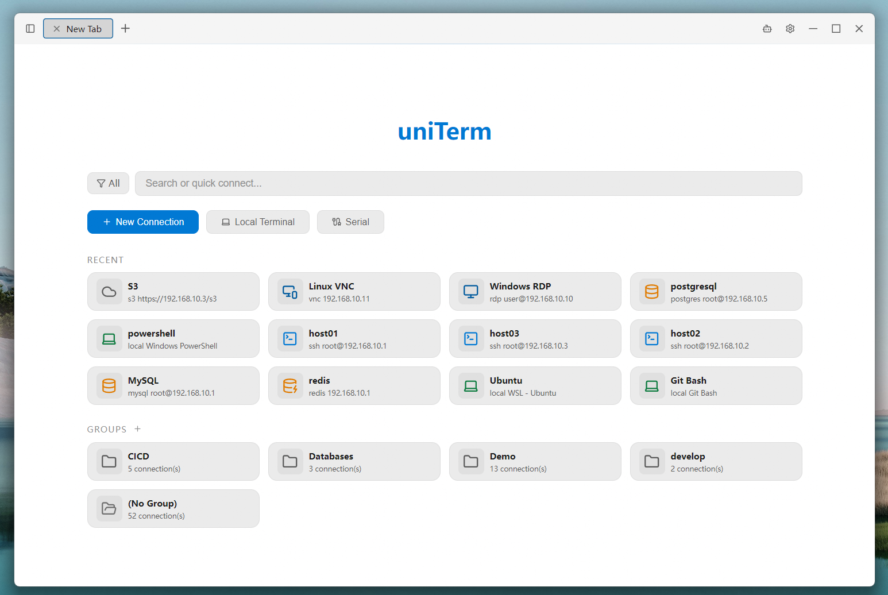
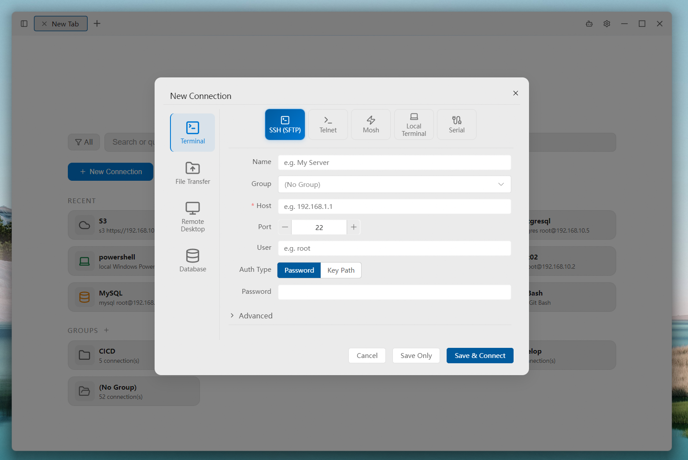
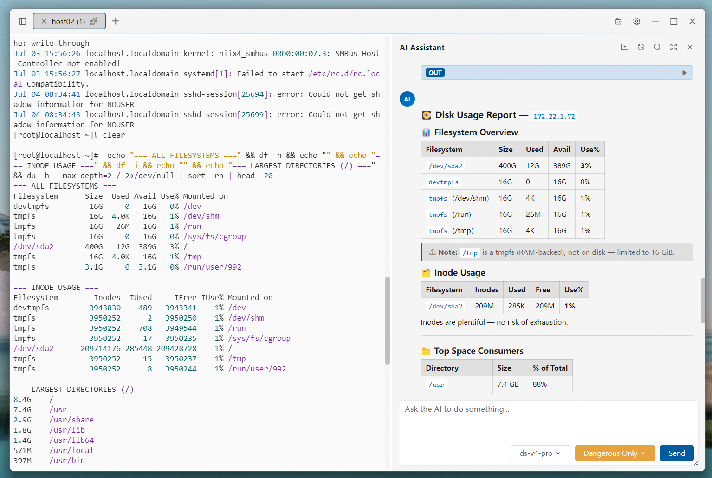
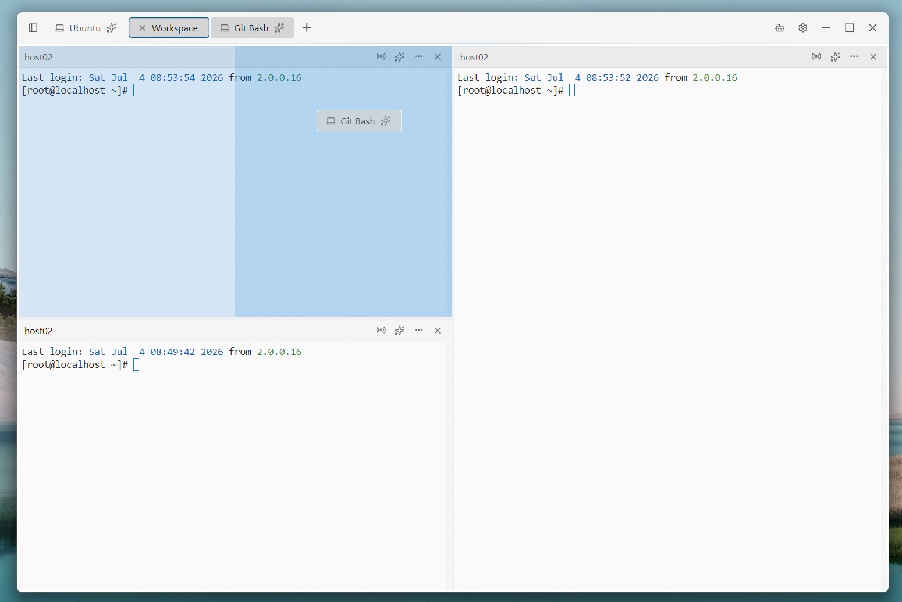
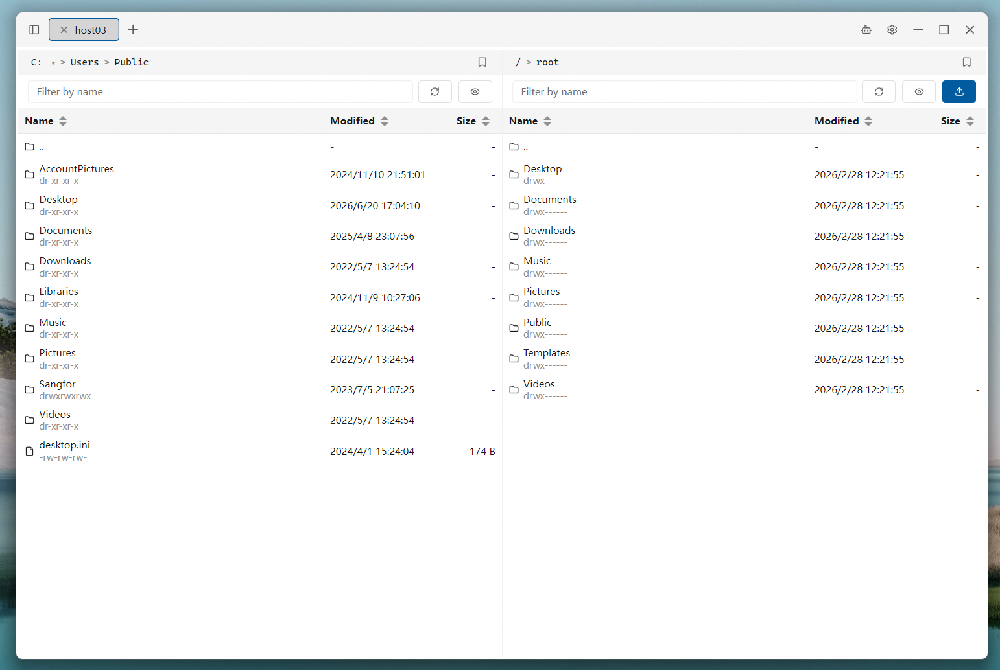
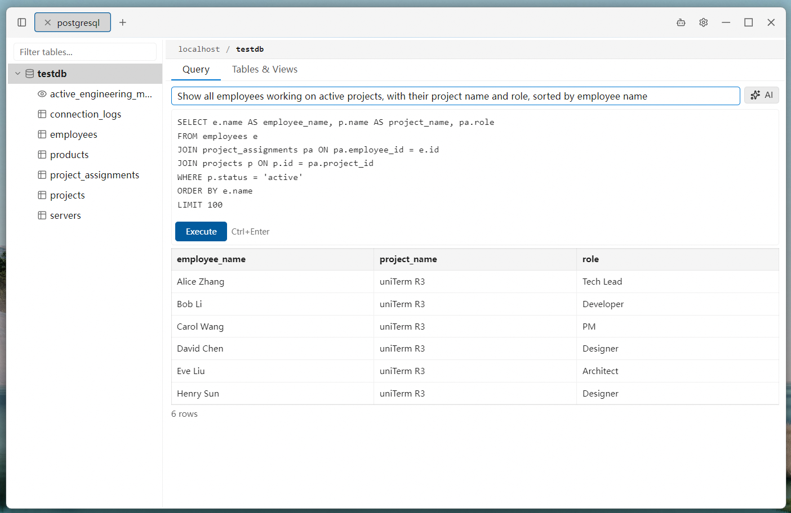

<div align="center">
  
  <h1>uniTerm</h1>
  <p>A lightweight all-in-one terminal with 20+ protocols — SSH, RDP, SFTP, databases and more<br>With a built-in autonomous AI Agent that plans and runs multi-turn shell commands</p>
  <p><a href="https://uniterm.net">🌐 Homepage</a> &nbsp;|&nbsp; <a href="https://uniterm.net/guide/en/introduction">📖 User Guide</a> &nbsp;|&nbsp; <a href="https://github.com/ys-ll/uniterm">💻 GitHub</a> &nbsp;|&nbsp; <a href="https://gitee.com/ys-l/uniterm">💻 Gitee</a></p>
</div>

<div align="center">

English &nbsp;|&nbsp; <a href="README_zh-CN.md">简体中文</a>

<br>

<a href="https://github.com/ys-ll/uniterm/releases/latest"></a>
<a href="https://github.com/ys-ll/uniterm"></a>
<a href="LICENSE"></a>
<a href="https://github.com/ys-ll/uniterm"></a>
<a href="https://gitee.com/ys-l/uniterm"></a>

</div>

## Table of Contents

- [Features](#features)
- [Supported Protocols](#supported-protocols)
- [Screenshots](#screenshots)
- [Download](#download)
- [Quick Workflows](#quick-workflows)
- [Tech Stack](#tech-stack)
- [Build from Source](#build-from-source)
- [Project Structure](#project-structure)
- [Star this Project](#star-this-project)
- [Feedback & Contributing](#feedback--contributing)
- [License](#license)

## Features

### Full-Featured Terminal

Remote terminal (SSH / Telnet / Mosh), local & serial terminal (PowerShell / CMD / Git Bash / WSL), file transfer, remote desktop, database, and server monitor — covering all remote access needs.

- **Remote Terminal** — SSH / Telnet / Mosh with password or key authentication; includes SSH tunnel port forwarding so any connection can route through an SSH jump host.
- **Local & Serial Terminal** — PowerShell / CMD / Git Bash / WSL plus serial connections with configurable baud rate, data bits, stop bits, parity, and local echo.
- **File Transfer** — SFTP / FTP / FTPS / SMB / WebDAV / S3 / Zmodem with dual-pane browsing and `rz`/`sz` support in SSH terminals.
- **Remote Desktop** — RDP (Windows Remote Desktop), VNC (Linux remote control), SPICE (KVM/QEMU VMs)
- **Database Client** — MySQL / PostgreSQL / Oracle / SQL Server / rqlite / Redis.
- **Server Monitor** — Real-time CPU, memory, disk, network, processes, ports, and network interfaces.

### AI Assistant

Autonomous AI Agent that independently plans and executes multi-turn shell commands directly in your terminal.

- **Autonomous Multi-Turn Execution** — The AI Agent can plan, execute, observe results, and iterate across multiple rounds of shell commands without manual intervention.
- **LLM Integration** — Sidebar chat with Anthropic/OpenAI-compatible API, supporting Claude, GPT and other compliant models.
- **Flexible Execution Modes** — Bypass, dangerous only, dangerous + write, or confirm all — you control how much oversight the AI Agent needs.
- **Persistent Conversations** — Chat history is saved per session, so conversations survive app restarts.
- **Terminal Integration** — AI commands execute directly in the active terminal tab, with optional pinning to a specific tab or following your active one. Collaborate side-by-side in split panes, each with its own terminal context.
- **Smart Completion** — While typing in SSH terminals, get real-time suggestions from your command history and AI-powered command rewrites.

### Personalization

Connection management, split panes, cloud sync, themes — your terminal, your way.

- **Connection Manager** — Group, quickly search, create, and batch-operate server connections.
- **Split Panes** — Drag terminal tabs into the content area to split freely and combine them into a workspace; drag panel edges to resize and rearrange.
- **Cloud Sync** — Encrypt and auto-sync settings via your own decentralized private repo on GitHub, GitLab, or Gitee — no worry about data loss or leaks, and pick up your work seamlessly across devices.
- **Custom Keybindings** — Freely bind keyboard shortcuts for every action for full keyboard-driven operation, hands never leaving the keyboard.
- **Themes** — 28 terminal themes plus 3 UI themes (Dark / Deep Blue / Light).
- **Internationalization** — 9-language UI: Simplified Chinese, Traditional Chinese, English, Japanese, Korean, German, Spanish, French, Russian.

## Supported Protocols

| Category | Protocol | Description |
|----------|----------|-------------|
| Terminal | SSH | Remote server shell management |
| Terminal | Telnet | Remote terminal for legacy devices and embedded systems |
| Terminal | Mosh | Server connections over high-latency or intermittent networks |
| Terminal | Serial | Serial port terminal with configurable baud rate and other parameters |
| Terminal | Local | PowerShell, CMD, Git Bash, and other local shells |
| Terminal | WSL | Open installed WSL distributions via local terminal |
| File Transfer | SFTP | Server file management and transfer |
| File Transfer | FTP / FTPS | Website hosting, NAS file transfer |
| File Transfer | SMB | Windows shared folders, NAS file access |
| File Transfer | WebDAV | WebDAV server file management |
| File Transfer | S3 | Amazon S3 compatible object storage |
| File Transfer | Zmodem | In-terminal file transfer via rz/sz commands |
| Remote Desktop | RDP | Windows server remote desktop management (Windows only) |
| Remote Desktop | VNC | Linux server remote control |
| Remote Desktop | SPICE | KVM/QEMU VM management |
| Database | MySQL | MySQL protocol: MySQL, MariaDB, TiDB, and more |
| Database | PostgreSQL | PostgreSQL protocol: PostgreSQL, CockroachDB, and more |
| Database | Oracle Database | Oracle Database connections through a pure Go driver |
| Database | SQL Server | SQL Server connections through a pure Go driver |
| Database | rqlite | Lightweight distributed DB built on SQLite with Raft consensus |
| Database | Redis | In-memory key-value store with visual key browsing and editing |

Oracle Database support is implemented with a pure Go driver. uniTerm does not bundle Oracle Database, Oracle Instant Client, OJDBC, wallet files, or Oracle brand assets; users are responsible for their own Oracle licenses, credentials, and database access.

## Screenshots

<p align="center">
  <picture>
    <source srcset="docs/imgs/start_tab.png" media="(prefers-color-scheme: dark)" />
    
  </picture>
  <picture>
    <source srcset="docs/imgs/new_connection.png" media="(prefers-color-scheme: dark)" />
    
  </picture>
</p>
<p align="center">
  <picture>
    <source srcset="docs/imgs/ai_assistant.png" media="(prefers-color-scheme: dark)" />
    
  </picture>
  <picture>
    <source srcset="docs/imgs/workspace.png" media="(prefers-color-scheme: dark)" />
    
  </picture>
</p>
<p align="center">
  <picture>
    <source srcset="docs/imgs/sftp.png" media="(prefers-color-scheme: dark)" />
    
  </picture>
  <picture>
    <source srcset="docs/imgs/database.png" media="(prefers-color-scheme: dark)" />
    
  </picture>
</p>
  </picture>
</p>

## Download

Get the latest pre-built binaries from [GitHub Releases](https://github.com/ys-ll/uniterm/releases) or [Gitee Releases](https://gitee.com/ys-l/uniterm/releases):

- **Windows**: installer `uniterm-windows-amd64-installer-*.exe`, or portable `uniterm-windows-amd64-portable-*.zip`
- **macOS**: Download `uniterm-darwin-universal-*.dmg`
- **Linux**: Download `uniterm-linux-amd64-*.tar.gz`

### Runtime Dependencies

- **Windows**: WebView2 runtime (included in Windows 10+; older versions need a one-time install)
- **macOS**: No extra dependencies (uses the system WebKit)
- **Linux**: `libgtk-3-0` and `libwebkit2gtk-4.1-0` (preinstalled on most desktop distros)

## Quick Workflows

### SSH Connection

1. Click **New Connection** in the Connection Manager
2. Fill in host, port, and authentication (password or private key)
3. Click **Connect** to open an SSH terminal session

### AI Assistant

1. Go to Settings and configure your **AI provider** (API endpoint, model, and key)
2. Open a terminal tab (SSH or local)
3. Open the AI sidebar chat — type your task, and the AI Agent executes commands directly in your terminal

### SFTP File Transfer

1. In the Connection Manager, **right-click** an SSH connection
2. Select **Connect SFTP**
3. Browse, upload, download, and drag-and-drop files in the dual-pane file manager

## Tech Stack

| Layer | Technology |
|-------|-----------|
| Desktop Framework | Wails v2 |
| Backend | Go |
| Frontend | Vue 3 + Pinia + Element Plus |
| Terminal | xterm.js |
| AI Protocol | Anthropic Messages API / OpenAI Chat Completions API |

## Build from Source

Requires [Go](https://go.dev/dl/) 1.23+, [Node.js](https://nodejs.org/) 20+, and [Wails CLI](https://wails.io/docs/gettingstarted/installation) v2. Additionally, macOS needs Xcode Command Line Tools, and Linux needs `libgtk-3-dev` and `libwebkit2gtk-4.1-dev`.

```bash
git clone https://github.com/ys-ll/uniterm.git
cd uniTerm
cd frontend && npm install && cd ..
wails dev                   # Development
wails build                 # Production build
```

## Project Structure

```
uniTerm/
├── main.go                       # Entry point
├── app.go                        # Wails bindings, LLM API proxy, SFTP API
├── backend/
│   ├── session/                  # SSH/SFTP/database session management
│   ├── database/                 # SQL execution, schema introspection, DSN builders
│   ├── store/                    # Persistent config (connections, AI, settings)
│   └── log/                      # File-based logging
├── frontend/
│   └── src/
│       ├── components/           # Vue components
│       ├── composables/          # Terminal composables
│       ├── stores/               # Pinia stores
│       ├── services/             # AI agent loop, LLM client
│       ├── i18n/                 # Translations
│       └── types/                # TypeScript type definitions
└── wails.json
```

## Star this Project

If uniTerm is helpful to you, please consider giving it a ⭐ Star — it's the best encouragement for the project and helps more people discover it.

[](https://github.com/ys-ll/uniterm)
[](https://gitee.com/ys-l/uniterm)

## Feedback &amp; Contributing

Issues, suggestions, and feedback are welcome at [GitHub Issues](https://github.com/ys-ll/uniterm/issues), and contributions via [Pull Request](https://github.com/ys-ll/uniterm/pulls) are always welcome.

Thanks to the following people for contributing code and improvements, and to everyone who reported issues and shared suggestions — you help make uniTerm better ❤️

- [@yuwei5380](https://github.com/yuwei5380)
- [@surenwuyuwuqiu](https://github.com/surenwuyuwuqiu)

## License

Apache 2.0
